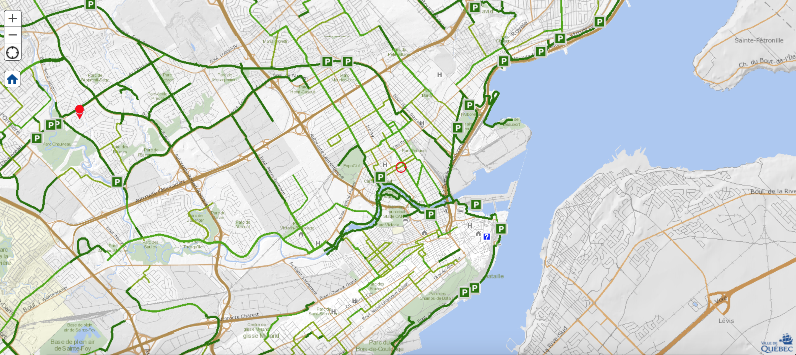
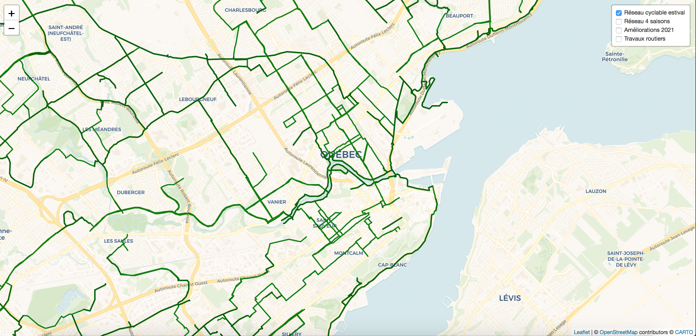
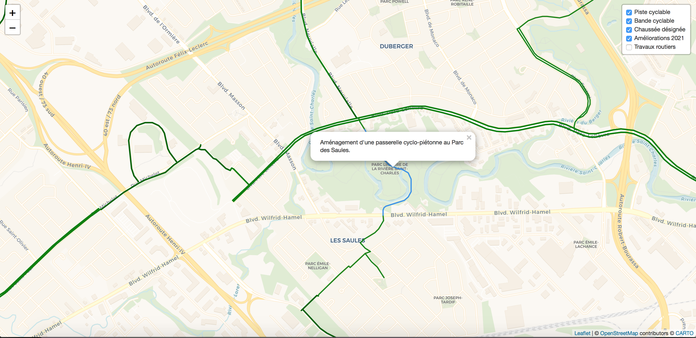
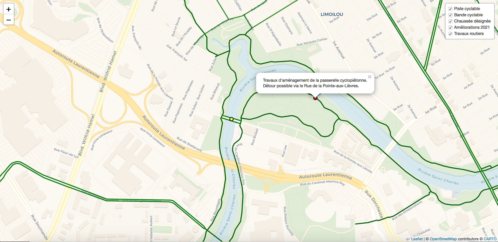

Carte _améliorée_ du réseau cyclable de Québec 🚲
================================================================================

La ville de Québec offre [une carte de son réseau cyclable](https://carte.ville.quebec.qc.ca/mobile?z=3&x=241231&y=5189013&fondcarte=ReseauCyclable#) pour les utilisateurs de son réseau. Or, la carte n'est malheureusement pas très belle ni rapidement mise à jour : nouveaux liens non ajoutés, travaux en cours qui fracture le réseau, rues partagées et piétones, etc.

Cette carte préparé à l'aide de __QGIS__, __R__ et __Shiny__ permet aux utilisateurs du réseau d'avoir une vision plus claire de notre beau réseau et de pouvoir en profiter à l'année !

> __Disclaimer__ : Cette carte n'est nullement associée à la Ville de Québec. Son utilisateur est faite aux risques et périls des utilisateurs.

Ancienne carte
--------------------------------------------------------------------------------

Carte améliorée
--------------------------------------------------------------------------------

Nouveautés 
--------------------------------------------------------------------------------

+ Mis à jour de la carte avec les projets réalisés l'an dernier
+ Ajout des travaux en cours sur le réseau (fermeture, déviation, etc.)
+ Ajout des améliorations à venir au réseau (passerelles, nouvelles pistes, etc.)

À venir
--------------------------------------------------------------------------------

+ Ajout du réseau cyclable de la Route Verte
+ Ajout du réseau cyclable de Lévis
+ Possibilité de mettre la carte à jour par les utilisateurs.
+ Lien cyclables 4 saisons

___Enjoy !___